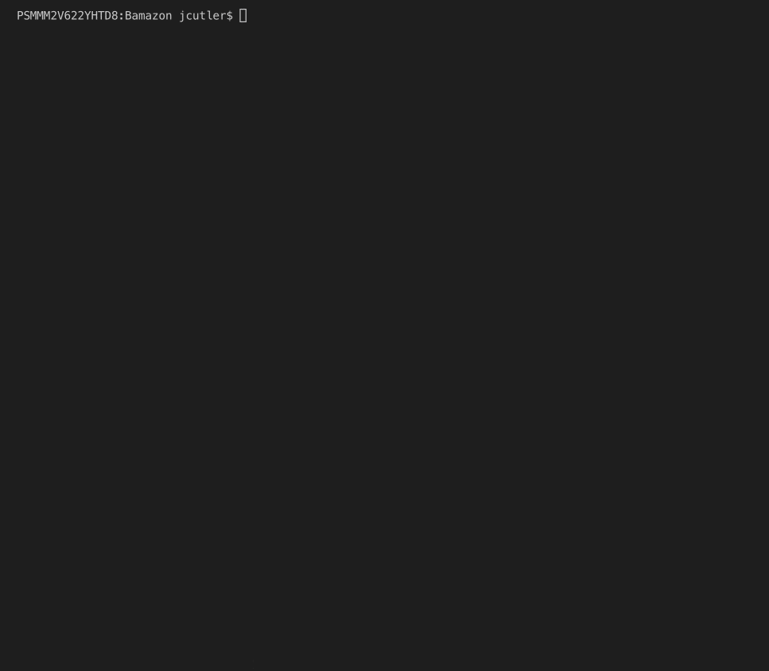

# Bamazon
## A simulated digital marketplace

This app is an Amazon-like storefront that uses the MySQL skills learned in the SQL unit of the UNH Coding Bootcamp. The app takes in orders from customers and deplete stock from the store's inventory. 

1. The app then prompt users with two messages.

   * The first should ask them the ID of the product they would like to buy.
   * The second message should ask how many units of the product they would like to buy.

2. Once the customer has placed the order, your application should check if your store has enough of the product to meet the customer's request.

   * If not, the app should log a phrase like `Insufficient quantity!`, and then prevent the order from going through.

3. However, if your store _does_ have enough of the product, you should fulfill the customer's order.
   * This means updating the SQL database to reflect the remaining quantity.
   * Once the update goes through, show the customer the total cost of their purchase.

#### Full Preview:

#### Screenshot of SQL Table:

This app uses the following Node modules:

   * [inquirer](https://www.npmjs.com/package/inquirer)
   * [mysql](https://www.npmjs.com/package/mysql)